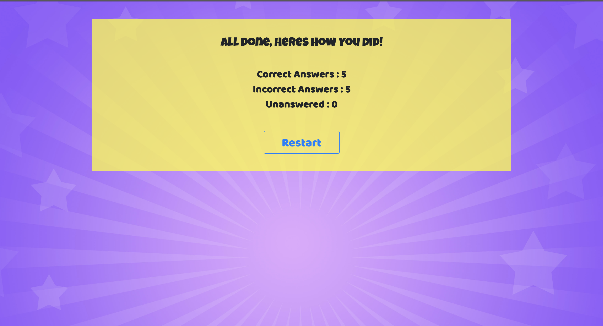

# Project Title: TriviaSmart
## A Smart Way To Play

### Team Member:
 * 1.Adliano Aalves
 * 2.Jayant Rai
 * 3.Luis RivasProject 

 ### API to be Used:
 * Trivia questions - https://opentdb.com/Location 
 * Giphy - https://api.giphy.com

 ### Lib used : 
 * Pushy Buttons - https://github.com/iRaul/pushy-buttons
 <!-- Services- ​https://rapidapi.com/montanaflynn/api/geocode-location-lookupTask  -->

 ### Services :
 * Firebase
 * Google Maps (If time permits)
 
 ### Breakdown:
 * Adliano- Organization, Project Management, Testing.
 * Jayant- Front / Back End.
 * Luis- Back End.

#### Splash Screen where User will Press start button to start the game
if enough time we will add some animation while data from API its loading

 #### Description:
 Cities will battle it out by answering trivia questions. 
 What city is the smartest, the brightest and overall coolest?
 
 #### Sketch Of Final Project

#### Splash Screen 

#### Screen with Questions, user will have 10 seconds to answer

##### Screnn to show GIF for right or wrong answer

#### Screen Show the final result
Firebase will be added to show users score and if enough time
will show the city that have the highest score

